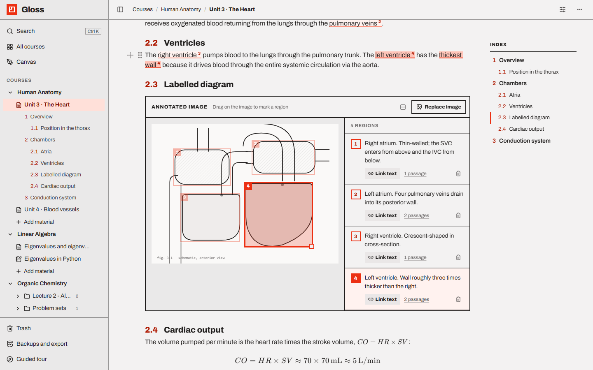

# Gloss documentation

Everything Gloss can do, chapter by chapter.

## Using Gloss

| Chapter | What's in it |
| --- | --- |
| [Getting started](getting-started.md) | Install, run, the guided tour, the sample courses, your first course, where notes are stored |
| [The workspace](workspace.md) | Courses and materials, sidebar, top bar, course pages, creating materials, moving and organising, search |
| [Pages](pages.md) | The block editor: `/` menu, shortcuts, toolbar, sections and the index, callouts, tables, formulas, `@` links, view options |
| [Annotated images](annotated-images.md) | Regions and comments, linking text to regions, hover highlighting, image pages, zoom and undo |
| [Slides, PDFs and folders](slides-and-pdfs.md) | Importing decks and PDFs, conversion, slide navigation, folders |
| [Notebooks](notebooks.md) | Cells, running code, shortcuts, outputs, browser Python, your own environments, `.ipynb` |
| [Canvas](canvas.md) | Drawings with Excalidraw, adding them to pages, drawing from a page |
| [Trash and version history](trash-and-history.md) | Undo, restoring, deleting for good, earlier versions |
| [Backups and export](backups-and-export.md) | Automatic backups, restoring, Markdown and PDF export, exporting everything |
| [Keyboard shortcuts](keyboard-shortcuts.md) | Every shortcut in one place |
| [Troubleshooting and FAQ](troubleshooting.md) | Common problems, questions, known limits |

## Running and developing

| Chapter | What's in it |
| --- | --- |
| [Configuration](configuration.md) | Environment variables, scripts, dev vs production, security model, limits |
| [Architecture](architecture.md) | Stack, project layout, data model, content formats, how things work |
| [HTTP API](api.md) | Every endpoint |

## Feature checklist

A quick map from feature to chapter.

- **Organise:** courses with codes · materials (pages, annotated images, notebooks, folders) · drag and drop between
  courses and folders · Move to… · sidebar tree with live outline — [workspace](workspace.md)
- **Find:** `Ctrl K` search across courses, materials, sections, text, comments, slide text, code and drawings, with
  jump-to-the-spot results — [workspace](workspace.md#search)
- **Write:** block editor with `/` menu and Markdown shortcuts · numbered sections and subsections · live index ·
  callouts · tables · toggle lists · code blocks · colours — [pages](pages.md)
- **Math:** `$…$` inline formulas, `$$` formula blocks, Σ toolbar button (KaTeX) — [pages](pages.md#formulas-latex)
- **Link:** `@` links to materials, slides and individual image regions · *Linked from* backlinks —
  [pages](pages.md#links-to-other-materials-)
- **Annotate:** draw, move, resize regions · numbered comments · link passages · three-way hover highlight · preview
  of off-screen regions · full-page image view with zoom, undo and split — [annotated images](annotated-images.md)
- **Import:** PDFs and PowerPoint/OpenDocument decks become folders of annotated slides, titled and searchable ·
  `.ipynb` notebooks — [slides](slides-and-pdfs.md), [notebooks](notebooks.md)
- **Compute:** Jupyter-style notebooks · Python in the browser (Pyodide) · your own venv/conda/pyenv environments via
  ipykernel · rich outputs · `input()` · interrupt — [notebooks](notebooks.md)
- **Draw:** Excalidraw canvas · drawings shared across pages · draw-and-insert from a page — [canvas](canvas.md)
- **Stay safe:** Trash with Undo and 30-day restore · version history with preview and restore · backup on every
  start · Back up now — [trash and history](trash-and-history.md), [backups](backups-and-export.md)
- **Take it with you:** Markdown zip of a course or material · print / save as PDF · export everything —
  [backups and export](backups-and-export.md)
- **Learn it:** first-run guided tour with Skip, replayable from the sidebar —
  [getting started](getting-started.md#first-launch-and-the-guided-tour)
- **Run it your way:** local-only by default · configurable data folder and ports — [configuration](configuration.md)
