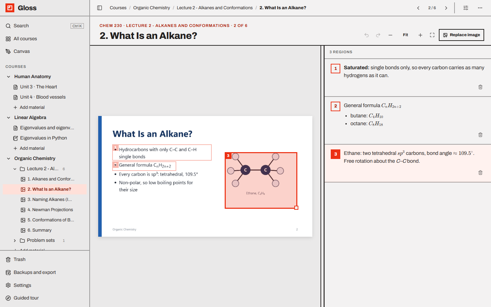

# Annotated images

Mark **regions** on an image, write a numbered **comment** for each, and link **passages** of your text to them.
Hover any of the three and all three light up.

Annotated images come in two forms:

- an **annotated image block** inside a [page](pages.md), where regions can be linked to the page's text;
- an **annotated image page** — one image filling the page, with its comments beside it (also what every imported
  slide becomes).

- [Adding an image](#adding-an-image)
- [Drawing and editing regions](#drawing-and-editing-regions)
- [Comments](#comments)
- [Region numbers](#region-numbers)
- [Linking text to a region](#linking-text-to-a-region)
- [Hover highlighting and the preview](#hover-highlighting-and-the-preview)
- [Layout of the block](#layout-of-the-block)
- [Annotated image pages](#annotated-image-pages)
- [Search, links and export](#search-links-and-export)

---

## Adding an image

**In a page**

- paste an image (`Ctrl V`) or drop an image file anywhere in the page — it becomes an annotated image block;
- or type `/annotated image` (also `/image`, `/img`, `/figure`, `/diagram`), then click the empty block (*Drop an
  image here, paste one, or click to upload*), drop a file onto it, or use **Upload image**.

**Replacing the image:** **Replace image**, or drop another image onto the block. Regions are kept (they are stored as
percentages of the image, so they stay in place on a same-shaped image).

While uploading, the block shows *Uploading name…*. If the server can't be reached: *Upload failed. Is the server
running?*

## Drawing and editing regions

| To | Do |
| --- | --- |
| **Draw** a region | Press and drag on an empty part of the image. Tiny boxes (under 1.5 % of the image) are ignored. The new region's comment opens, ready to type. |
| **Move** it | Drag the box. It stays inside the image. |
| **Resize** it | Drag its bottom-right corner (*Drag to resize*). |
| **Edit its comment** | Click the box, or click the comment. |
| **Delete** it | The trash icon next to its comment (*Delete region*). No confirmation; `Ctrl Z` undoes it. |

A click on an empty part of the image (without dragging) just closes the open comment. Each drag is one undo step.

## Comments

The comment list (headed *4 regions*) shows each region's **number**, its comment (*Add a comment…* if empty),
**Link text**, how many **passages** link to it, and the delete icon.

- Click a comment to edit it. **Enter** saves, **Shift Enter** adds a new line, **Esc** or clicking away also saves.
- Comments are **Markdown with LaTeX**: `**bold**`, `*italic*`, lists (`- item`), `` `code` ``, links
  (`[text](https://…)`, opened in a new tab), `$x^2$` for a formula in the line and `$$…$$` for a centred one. They are
  shown formatted; clicking the text opens the source for editing (clicking a link follows it). Each line break is kept.
  The same formatting appears in the hover preview, in printouts and PDFs, and (as Markdown) in exports.
- **3 passages** jumps to the linked passages in the text; click again for the next one.

## Region numbers

Regions are numbered **through the whole page**: if the first image on a page has regions 1–3, the second image's
regions start at 4. The same number appears on the box, the comment, and every passage linked to it (as a small
superscript). Numbers update when regions are added or deleted earlier on the page.

## Linking text to a region

Linked passages are how your notes point at the picture. Two ways:

**Link text (several passages at once)**

1. Click **Link text** under a comment. It changes to **Linking… done** and a banner appears: *Select a passage
   anywhere on this page to link it to region 3.*
2. Select passages with the mouse, anywhere on the page. Each selection is linked as soon as you release the mouse.
3. Click **Done** in the banner (or **Linking… done**, or press `Esc`).

**Link to region (from the toolbar)**

Select a passage and click the **Link to region** button in the formatting toolbar (it appears when the page has
regions). Pick a region from the list (number and comment). If the passage is already linked, the list ticks its
region and offers **Remove link**.

A passage belongs to one region at a time; linking it again moves it. Deleting a region unlinks its passages. Deleting
the whole image block hides the links (undo brings them back).

The look of linked passages is set in **View options → Linked passages**: *Marker* (tinted and underlined) or
*Underline only*.

## Hover highlighting and the preview

Hovering a **region box**, its **comment**, or a **linked passage** highlights all three: the box is outlined and the
other boxes fade, the comment is tinted, and every passage of that region is marked.

When you hover a passage whose image is scrolled out of view, a small **preview** of the image with that region and
its comment appears next to the text.

## Layout of the block

The icon in the block's header switches between comments **beside the image** (default) and comments **below the
image** (as a grid of cards). In a narrow window the comments always go below.

## Annotated image pages

Create one with **New material → Annotated image**, or import slides (every slide becomes one —
see [Slides and PDFs](slides-and-pdfs.md)). The image fills the left side and its comments the right.

- **Label:** course · *Annotated image*, or course · folder · *3 of 32* for a slide; then the title and the pages that
  link here (**Linked from**).
- **Add the image:** drop it on the empty area, paste it (`Ctrl V`), or **Upload image**. Pasting over an existing
  image asks *Replace the image with the pasted one? Regions are kept.*; dropping or uploading replaces it directly.
- **Regions and comments** work as described above. Numbers are 1, 2, 3… for this image. Regions here can be linked
  from pages with `@` (an image page has no text of its own to link).
- **Drag the divider** between image and comments to resize them (remembered for all image pages). On phones they
  stack.

**Toolbar** (to move between the slides of a folder, use **‹ ›** in the top bar or `←` / `→` — see
[Moving between slides and pages](slides-and-pdfs.md#moving-between-slides-and-pages))

| Button | Keys | Action |
| --- | --- | --- |
| Undo / Redo | `Ctrl Z` / `Ctrl Shift Z` or `Ctrl Y` | Undo or redo region and comment changes (up to 200 steps, until you leave the page) |
| Zoom out / Zoom in | `-` / `+` (or `=`) | 50 %, 75 %, Fit, 150 %, 200 %, 300 %, 400 % |
| *Fit* / Fit to pane | `0` | Fit the image to the pane |
| **Upload image** / **Replace image** | `Ctrl V` to paste | Set or replace the image |

The keys work whenever you are not typing in a field. When zoomed in, scroll the image pane to move around.

## Search, links and export

- `Ctrl K` search finds region **comments** (labelled *Region 3*): picking one scrolls to the region and lights it up.
- `@` in a page can link to a single region (search for words in its comment); clicking that link opens the image and
  lights the region.
- [Markdown exports](backups-and-export.md#markdown-export) include the image followed by its numbered comments;
  [PDFs](backups-and-export.md#print-and-pdf) print the numbered boxes on the image with the comments below.
