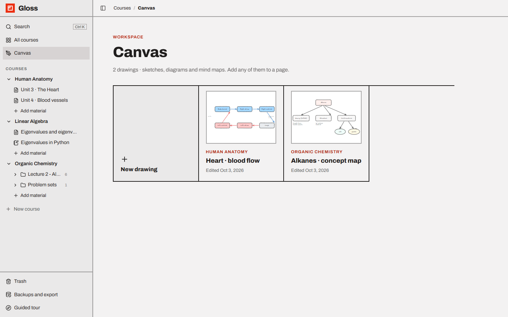
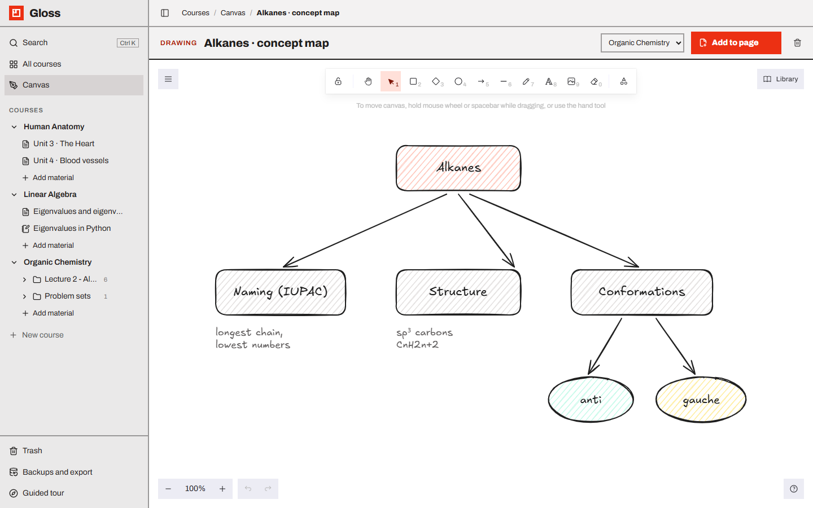

# Canvas (drawings)

Gloss includes [Excalidraw](https://excalidraw.com) for hand-drawn sketches, diagrams and mind maps. A drawing is a
single shared object: it lives in the **Canvas** and can be shown on any number of pages.

- [The Canvas list](#the-canvas-list)
- [Editing a drawing](#editing-a-drawing)
- [Adding a drawing to a page](#adding-a-drawing-to-a-page)
- [Drawing from inside a page](#drawing-from-inside-a-page)
- [The drawing block on a page](#the-drawing-block-on-a-page)
- [Deleting and restoring drawings](#deleting-and-restoring-drawings)
- [Search and export](#search-and-export)
- [Good to know](#good-to-know)

---

## The Canvas list

Open it with **Canvas** in the sidebar (`/canvas`).

- The header shows how many drawings you have: *"3 drawings · sketches, diagrams and mind maps. Add any of them to a
  page."*
- The first card, **New drawing**, creates an empty drawing right away and opens it. It starts with the title
  *Untitled drawing* and no course.
- Every other card is one drawing, most recently edited first:
  - a **thumbnail** of the drawing (or *Empty* when nothing is drawn yet),
  - the **course** it belongs to (or *No course*),
  - its **title**,
  - **Edited** and the date.
- Click a card to open the drawing.

## Editing a drawing

The drawing opens full width with a toolbar above the canvas:

| Control | What it does |
| --- | --- |
| **Title** | Rename the drawing. Saved as you type. |
| **Course** | Attach the drawing to a course, or choose *No course*. Hidden on narrow screens. |
| **Add to page** | Put the drawing at the end of a page (see below). |
| 🗑 **Delete drawing** | Move it to the Trash. |

Everything you draw is **saved automatically** about a second after you stop. The top bar shows *Saving…*,
*Saved*, or *Not saved — retrying on next edit* if the server could not be reached; unsaved changes are kept and sent
with your next edit. If you try to close the tab before a change is saved, the browser asks you to confirm.

What is saved: the shapes, any images you pasted into the drawing, the background colour, a picture of the drawing
(used for thumbnails and pages) and the words you wrote (for search). The zoom and scroll position are not saved: a
drawing always opens zoomed to fit its content.

Excalidraw works as usual (shapes, arrows, text, freehand, images, libraries, colours…), with a few changes:

- the light theme is always used, and Excalidraw's own *Open*, *Save to file* and *Export scene* menu entries are
  turned off, because Gloss stores the drawing for you;
- Excalidraw's hand-drawn fonts are served by Gloss itself, so drawing works offline;
- while the canvas has the keyboard focus, `Ctrl K` belongs to Excalidraw (it adds a link to the selected shape). To
  search Gloss from a drawing, use **Search** in the sidebar or click the title field first.

## Adding a drawing to a page

**Add to page** opens a list of every page, grouped by course, with the drawing's own course first (pages inside
folders included; notebooks and image pages are not listed because they have no blocks). Click a page:

1. any unsaved strokes are saved first;
2. a drawing block is added at the **end** of that page;
3. the dialog confirms *"The drawing is now at the end of **page**. Edits you make here show up there too."* with an
   **Open page** button.

You can add the same drawing to several pages, or more than once to the same page.

## Drawing from inside a page

In a page, type `/drawing` (also found as *draw, sketch, canvas, excalidraw, whiteboard, diagram, mindmap*) and pick
**Drawing**. A drawing block is inserted and the canvas opens over the page:

- the toolbar shows **New drawing**, a title field, the hint *Ctrl+Enter to insert*, **Cancel** and
  **Insert into page**;
- **Insert into page** (or `Ctrl Enter` / `⌘ Enter`, even while drawing) becomes available once there is at least
  one shape;
- **Cancel** asks *"Discard your changes to this drawing?"* if you drew something; cancelling a brand-new drawing
  removes the empty block so nothing is left on the page.

New drawings made this way belong to the page's course, so they also appear in the Canvas list.

To change a drawing that is already on a page, click its picture or **Edit drawing**. The same full-screen editor
opens with **Edit drawing** and **Save drawing** (`Ctrl Enter`), enabled once something changed.

## The drawing block on a page

A drawing block shows:

- the label **Drawing** and the drawing's title (or *Not drawn yet*),
- an **Open in Canvas** icon (opens the drawing on its own),
- **Edit drawing** (or **Draw** for an empty block),
- the picture itself (click to edit), or *Empty drawing — click to draw*.

The block only points to the drawing. Editing the drawing anywhere — on any page or in the Canvas — updates it
everywhere. Removing the block from a page does **not** delete the drawing; it stays in the Canvas.

If the drawing was deleted, the block says *This drawing was deleted from the Canvas.* Restoring the drawing from the
Trash brings the block back to life.

## Deleting and restoring drawings

**Delete drawing** in the drawing's toolbar saves any pending strokes, moves the drawing to the
[Trash](trash-and-history.md) and shows *Moved "…" to the trash* with **Undo**. In the Trash it is listed as a
*Drawing* in its course (or *Canvas*). Restore it within 30 days to bring it back on every page that shows it.

## Search and export

- `Ctrl K` search finds drawings by **title** and by the **text written inside them**. Results are labelled
  *Drawing*; with an empty search box, your most recent drawings are listed.
- In a [Markdown export](backups-and-export.md#markdown-export) each drawing on a page becomes an SVG picture in
  `assets/`.
- In the [printable view / PDF](backups-and-export.md#print-and-pdf) drawings are printed as pictures.

## Good to know

- Images pasted into a drawing are stored inside the drawing itself, so very image-heavy drawings get large (up to
  60 MB per save).
- The Canvas list has no delete or rename buttons; open the drawing to do that.
