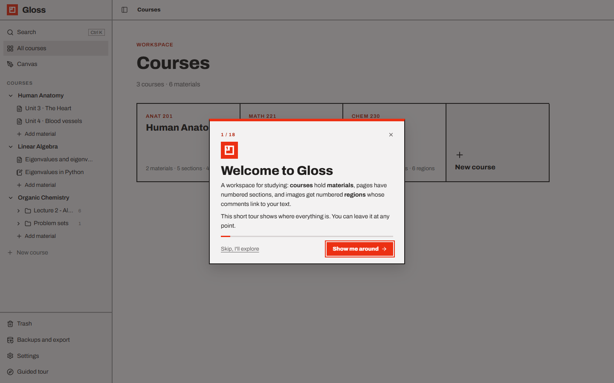
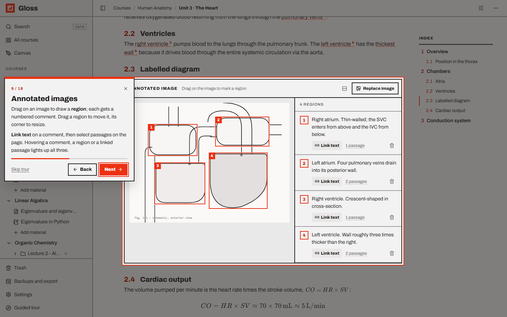
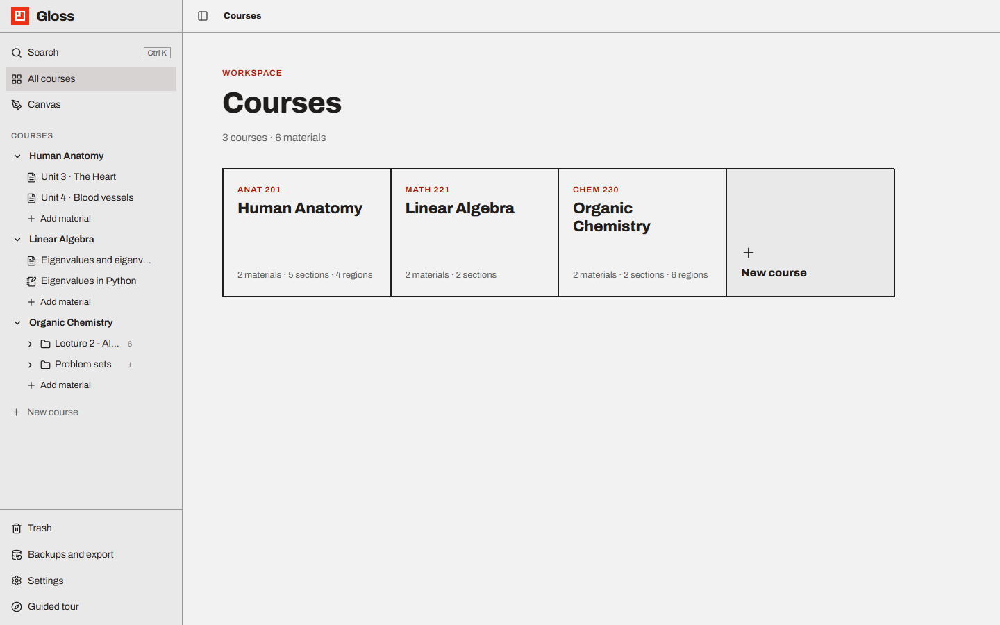

# Getting started

- [Requirements](#requirements)
- [Install and run](#install-and-run)
- [Development mode](#development-mode)
- [Run it without the launcher](#run-it-without-the-launcher)
- [First launch and the guided tour](#first-launch-and-the-guided-tour)
- [The sample courses](#the-sample-courses)
- [Your first course in five minutes](#your-first-course-in-five-minutes)
- [Where your notes are stored](#where-your-notes-are-stored)
- [Updating](#updating)

---

## Requirements

| Needed | Why |
| --- | --- |
| **Node.js 22.13 or newer** | Gloss uses Node's built-in SQLite database. Check with `node --version`. |
| A modern browser | Chrome, Edge, Firefox or Safari. |
| *Optional:* Microsoft PowerPoint or LibreOffice | To import `.pptx` / `.odp` slide decks (PDFs work without them). |
| *Optional:* Python with `ipykernel` | To run notebooks in your own environments (browser Python works without it). |
| *Optional:* internet | Only for loading Python packages in browser notebooks the first time. Everything else works offline. |

## Install and run

Get the code:

```bash
git clone https://github.com/HaithamIsmail/gloss.git
cd gloss
```

Then start it with the launcher:

| System | How |
| --- | --- |
| Windows | Double-click **`start.bat`** (or run it from a terminal) |
| macOS / Linux | `./start.sh` |
| Anywhere | `npm run app` |

The launcher:

1. checks that Node.js is 22.13 or newer;
2. installs the dependencies on the first run, and again after an update changed them;
3. builds the web app when its code changed since the last build (the first start takes a minute or two; later starts
   take seconds);
4. starts Gloss on **http://localhost:3001** and opens it in your browser once it's ready.

If Gloss is already running, the launcher just opens it in the browser. Stop Gloss with `Ctrl C` in its window (or by
closing the window).

Launcher options (after `start.bat`, `./start.sh` or `npm run app --`):

| Option | Effect |
| --- | --- |
| `--port 8080` | Use another port |
| `--no-open` | Don't open the browser |
| `--dev` | Run the development servers instead (see below) |

Tip: on Windows, right-click `start.bat` → *Send to* → *Desktop (create shortcut)* to start Gloss from your desktop.

## Development mode

```bash
npm install
npm run dev
```

Open **http://localhost:5173**. `npm run dev` starts two things side by side: the API server on port 3001 (restarts
when server code changes) and the Vite web server on port 5173 (reloads the page when client code changes). Stop both
with `Ctrl C`.

## Run it without the launcher

```bash
npm install
npm run build
npm start
```

Open **http://localhost:3001**. The server serves the built app and the API on one port. Run `npm start` from the
project folder (it looks for `dist/` and `data/` there). See [Configuration](configuration.md) for ports and other
settings.

## First launch and the guided tour



The first time you open Gloss in a browser, a **guided tour** walks you through the app in about 18 short steps:

1. **Welcome** — choose **Show me around**, or **Skip, I'll explore**.
2. Each step dims the screen, outlines one part of the app in red and explains it next to it. It opens the pages it
   talks about (a course, a page with an annotated image, a notebook…) by itself.
3. Use **Next** / **Back** (or `→` / `←`, `Enter`), or **Skip tour** / the ✕ (or `Esc`) at any time. A bar shows how far
   along you are.



The tour covers: the course tree, search, adding materials, organising and exporting a course, writing with blocks,
the index, annotated images, formulas and `@` links, the page and view menus, notebooks and kernels, image pages,
the Canvas, the Trash and backups, and themes. Steps about things your workspace doesn't have yet (e.g. no notebook) are left
out.

Once finished or skipped, the tour doesn't come back by itself (your browser remembers it). Replay it any time with
**Guided tour** at the bottom of the sidebar.

## The sample courses



On a brand-new installation, Gloss fills the workspace with examples that show every kind of content:

- **Human Anatomy (ANAT 201)**
  - *Unit 3 · The Heart* — numbered sections, a callout, a labelled heart diagram with 4 regions linked to passages in
    the text, a formula, lists and a check list.
  - *Unit 4 · Blood vessels* — `@` links to the heart page and to one region of its diagram.
- **Linear Algebra (MATH 221)**
  - *Eigenvalues and eigenvectors* — inline formulas and a formula block.
  - *Eigenvalues in Python* — a notebook using numpy.
- **Organic Chemistry (CHEM 230)** — empty, ready for you.

The screenshots in this documentation use these courses plus an imported lecture PDF (*Lecture 2 · Alkanes and
Conformations*), a folder of problem sets and two drawings.

Delete them whenever you like (they go to the Trash). To start with an empty workspace instead, set `SEED=0` before the
very first launch (see [Configuration](configuration.md)).

## Your first course in five minutes

1. **New course** in the sidebar. Type its name over *Untitled course*, and a code above it.
2. **+ New material → Page**. Type the title, press `Enter`.
3. Type `# ` and a heading — that's **Section 1**. Type `## ` for **Subsection 1.1**. Watch the index on the right.
4. Paste a diagram (`Ctrl V`). Drag boxes on it and write a comment for each region.
5. Click **Link text** on a comment and select the words in your notes that describe it. Hover them.
6. Type `$E = mc^2$` for a formula and `@` to link another page.
7. Import your lecture slides with **Import slides or PDF** on the course page and annotate each slide.

## Where your notes are stored

Everything is in the `data/` folder of the project:

| Path | Contents |
| --- | --- |
| `data/study.db` | The database: courses, materials, regions, notebooks, drawings, trash, versions |
| `data/uploads/` | Images, PDFs and files you added |
| `data/backups/` | Automatic database backups (the latest 20) |
| `data/notebooks/<id>/` | Working folders of local notebook kernels |
| `data/themes/` | Your own [themes](themes.md) |

Gloss backs up the database every time it starts — see [Backups and export](backups-and-export.md). The `data/` folder
is not part of the Git repository (it's in `.gitignore`), so your notes stay on your machine.

## Updating

Stop Gloss, then:

```bash
git pull
```

and start it again with the launcher: it installs new dependencies and rebuilds the app by itself. (Without the
launcher: `npm install`, then `npm run build && npm start`.)

Your `data/` folder is untouched by updates. Gloss upgrades the database by itself when it starts (adding new tables or
columns), and backs it up first if anything changed since the last backup.
