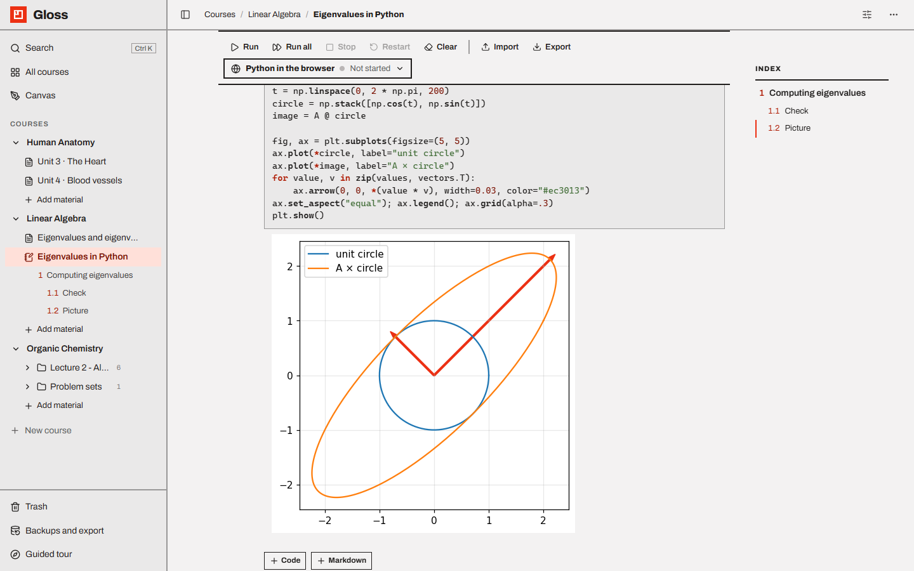

# Notebooks

A **Notebook** is a Jupyter-style page of code and markdown cells. Python runs either **in your browser** (nothing to
install) or in **one of your own Python environments** (venv, conda, pyenv…) through a real Jupyter kernel.

- [The notebook page](#the-notebook-page)
- [Cells](#cells)
- [Running code](#running-code)
- [Keyboard shortcuts](#keyboard-shortcuts)
- [Markdown cells](#markdown-cells)
- [Outputs](#outputs)
- [Choosing a kernel](#choosing-a-kernel)
- [Python in the browser](#python-in-the-browser)
- [Your own Python environments](#your-own-python-environments)
- [Importing and exporting .ipynb](#importing-and-exporting-ipynb)
- [Saving, search and links](#saving-search-and-links)
- [Not supported (yet)](#not-supported-yet)

---

## The notebook page

- **Label:** course code · course name · *Notebook*, then the **title**.
- **Toolbar** (stays at the top while you scroll):

| Button | What it does |
| --- | --- |
| **Run** | Run the selected cell and move to the next (`Shift Enter`). |
| **Run all** | Run every code cell from the top. If one fails, the cells after it are skipped. |
| **Stop** | Interrupt the running code (local kernels only). |
| **Restart** | Restart the kernel: all variables are cleared. Asks first if code is running. |
| **Clear** | Clear all outputs and execution counts (the kernel keeps its variables). |
| **Import** | Replace the cells with a `.ipynb` file. |
| **Export** | Download the notebook as `.ipynb`. |
| **Kernel picker** (right) | Choose where Python runs, and see its status. |

On narrow screens the toolbar shows icons only.

- At the end of the notebook: **+ Code** and **+ Markdown** add a cell; then **Linked from** (pages that link here
  with `@`).
- The **Index** on the right lists the notebook's `#` sections and `##` subsections.

A new notebook starts with a markdown cell (*# Notes …*) and an empty code cell.

## Cells

There are **code** cells and **markdown** cells (raw cells from imported notebooks are kept too).

- **Select** a cell by clicking it: it gets a red bar on the left.
- **Edit mode:** click into the code (or double-click a markdown cell) to type.
- **Command mode:** press `Esc`, or click the cell's frame, to use single-key shortcuts (below).
- Hover or select a cell to see its **tools** (top right): **Move up**, **Move down**, **Make markdown (M)** /
  **Make code (Y)**, **Delete (D, D) · Z restores**.
- Hover between cells for **+ Code** / **+ Markdown** to insert a cell below.
- Code cells show their execution count on the left: `[ ]` not run yet, `[*]` running or waiting, `[3]` done. Hover it
  to get a ▶ button that runs the cell.
- Changing a code cell to markdown removes its outputs.

The code editor has Python highlighting, auto-closing brackets, autocomplete (`Ctrl Space`), multiple cursors and line
wrapping. `Tab` / `Shift Tab` indent and dedent; `Ctrl /` toggles a comment; `Alt ↑` / `Alt ↓` move a line.

## Running code

| Keys | Action |
| --- | --- |
| `Shift Enter` | Run, then go to the next cell (at the last cell a new code cell is added) |
| `Ctrl Enter` | Run and stay on the cell |
| `Alt Enter` | Run and insert a new code cell below |

- The kernel starts the first time you run code on the page.
- Cells run **one after another**; cells you run while others are busy wait their turn (`[*]`).
- When a cell fails, the cells waiting after it are skipped.
- An empty code cell does nothing when run.
- The previous output stays visible until the new output arrives.

## Keyboard shortcuts

**Edit mode** (typing in a cell): `Shift Enter`, `Ctrl Enter`, `Alt Enter` as above; `Esc` → command mode.

**Command mode** (after `Esc`):

| Key | Action |
| --- | --- |
| `Enter` | Edit the cell |
| `↑` / `k`, `↓` / `j` | Select the previous / next cell |
| `a` / `b` | Insert a code cell above / below |
| `m` / `y` | Make the cell markdown / code |
| `d` `d` | Delete the cell (press `d` twice quickly) |
| `z` | Bring back the last deleted cell (repeat for earlier ones) |
| `Shift Enter`, `Ctrl Enter`, `Alt Enter` | Run, as above |

Letters are lowercase, without Shift or Caps Lock.

## Markdown cells

- **Double-click** a rendered markdown cell to edit it; run it (`Shift Enter`) or select another cell to render it.
- Supports GitHub-flavoured Markdown (tables, strike-through, links, images) and **math**: `$…$` inline and `$$…$$`
  on its own line, rendered with KaTeX.
- `#` lines are **Sections** and `##` lines are **Subsections**: numbered (if *Number sections* is on), listed in the
  index and in the sidebar, and counted on the course page.
- Images embedded in imported notebooks (cell attachments) are shown.
- HTML in markdown is cleaned for safety: scripts, styles, forms and inputs are removed.

## Outputs

Each code cell shows what it printed and returned:

- **text** (stdout, and stderr on a tinted background), with terminal colours; progress bars that redraw a line work;
- **errors** with their traceback, in red;
- **pictures** (PNG, JPEG, SVG) — e.g. matplotlib plots;
- **HTML** such as pandas tables (cleaned: no scripts or styles);
- **Markdown**, **LaTeX** and **JSON** outputs;
- `clear_output()` works (also with `wait=True`);
- **`input()` and `getpass()`** (local kernels): a field appears under the cell; type and press `Enter`.

Click the thin bar on the left of an output to **collapse** it (*Output hidden · click to show*). Long outputs scroll.
Outputs are saved with the notebook, so they are there next time.

## Choosing a kernel

Click the kernel button at the right of the toolbar. It shows the kernel's name and status: *Not started*,
*Starting…*, *Idle* (green), *Busy* (pulsing red), *Stopped*, *Disconnected*, or a loading message.

The picker lists:

- **In the browser — Python in the browser** (*Pyodide · nothing to install*).
- **On this computer** — every Python found on your machine, with its kind (*Conda*, *Virtual env*, *pyenv*,
  *System*), version and path. **↻ Search again** rescans.
- **Add an interpreter…** — paste an environment folder or a `python` executable path.
- For local kernels, the kernel's **working folder** (see below).

Each notebook remembers its kernel. New notebooks use the last kernel you chose in this browser.

## Python in the browser

Runs [Pyodide](https://pyodide.org) (Python 3.14 compiled to WebAssembly) inside the page.

- Nothing to install. The Python runtime is served by Gloss itself.
- Packages are loaded automatically when you `import` them: numpy, pandas, matplotlib, scipy, scikit-learn, sympy,
  statsmodels, networkx, pillow and about 300 more. **The first use of a package needs internet** (they come from the
  Pyodide CDN).
- `%pip install package` (or `!pip install`) installs pure-Python packages from PyPI.
- `plt.show()` shows the figure; figures left open are shown after the cell.
- The value of the last line is displayed (end it with `;` to hide it). `display()`, `IPython.display` `HTML`,
  `Markdown`, `Latex`, `Math`, `Image` and `clear_output` work.

Limits: it **can't be interrupted** (use Restart, which also forgets installed packages); `input()` doesn't work; other
`%magics` and `!commands` aren't available; it can't read files on your computer; leaving the page resets it.

## Your own Python environments

Choose an environment under **On this computer** to run a real Jupyter kernel (`ipykernel`) inside it, with all your
installed packages, `input()`, **Stop** (interrupt, also on Windows), `%magics`, `%%cell magics` and `!shell` commands.
The environment is activated for the kernel, so `!pip install …` installs into that environment.

**Where Gloss looks for Python**

| Kind | Places |
| --- | --- |
| On your PATH | `python` / `python3` (the Microsoft Store stub is skipped) |
| Windows launcher | everything `py -0p` lists |
| macOS / Linux | `/usr/bin/python3`, `/usr/local/bin/python3`, `/opt/homebrew/bin/python3` |
| Conda | environments in `~/.conda/environments.txt`, `$CONDA_PREFIX`, and the `envs/` folders of miniconda3, anaconda3, miniforge3, mambaforge, micromamba installs in your home folder (and `%LOCALAPPDATA%`, `C:\ProgramData`, `/opt`) |
| venv / virtualenv | `$VIRTUAL_ENV`, `~/.virtualenvs`, `~/.venvs`, `~/venvs`, `~/Envs`, `~/.venv`, `~/venv` |
| pipenv / Poetry | `~/.local/share/virtualenvs`, `~/.cache/pypoetry/virtualenvs` (and Poetry's Windows cache) |
| pyenv | `~/.pyenv/versions/*` (and pyenv-win) |
| Added by you | anything added with **Add an interpreter…** |

Project `.venv` folders elsewhere, uv/hatch/pixi environments and macOS Poetry caches are not scanned: use **Add an
interpreter…** with the folder (Gloss finds `python.exe`, `Scripts\python.exe`, `bin/python3` or `bin/python` in it).
Added interpreters are remembered.

**ipykernel**

An environment without `ipykernel` is greyed out and shows **Install ipykernel**. Clicking it asks first, then runs
`python -m pip install ipykernel` in that environment and shows the last lines of pip's output. When it succeeds, the
environment is selected.

**Working folder**

Each notebook's local kernel starts in its own folder, shown in the picker: `data/notebooks/<notebook id>/`. Put data
files there to open them by name (`pd.read_csv("grades.csv")`). It is included in
[Export everything](backups-and-export.md#export-everything).

**Kernel lifetime**

- One kernel per notebook. Several tabs of the same notebook share it.
- Leaving the page keeps the kernel running for **15 minutes**: come back and your variables are still there (the
  picker shows *Not started* until you run something). Output printed while no page was open is lost.
- If the connection drops, Gloss reconnects automatically (*Disconnected*, then back).
- **Restart** starts a fresh kernel; quitting Gloss stops all kernels.
- If a remembered environment no longer exists, the notebook stays *Disconnected*: pick another kernel.

## Importing and exporting .ipynb

- **New material → Import notebook** creates a notebook from a `.ipynb` file (titled after the file).
- **Import** in the toolbar replaces this notebook's cells (asks first if it has content). Outputs, execution counts
  and attachments are kept.
- **Export** downloads the notebook as `.ipynb` (nbformat 4.5) with its outputs — including unsaved changes — ready to
  open in Jupyter, VS Code or Colab.
- Notebooks are also exported (as `.md` + `.ipynb`) in [Markdown exports](backups-and-export.md#markdown-export) and
  printed in [PDFs](backups-and-export.md#print-and-pdf).

## Saving, search and links

- Everything (code, outputs, kernel choice) **saves automatically** a moment after each change.
- `Ctrl K` search finds code (*Code*), headings (*Section*, *Subsection*) and markdown text in notebooks; picking a
  result scrolls to the cell and selects it.
- Pages can link to a notebook with `@`; it lists them under **Linked from**.
- [Version history](trash-and-history.md#version-history) keeps earlier states of cells and outputs.

## Not supported (yet)

Copy/cut/paste or drag of cells, merging and splitting cells, find and replace inside cells, line numbers, widgets and
JavaScript outputs (Plotly, Bokeh, ipywidgets), a variable inspector, run above/below, removing an added interpreter.
