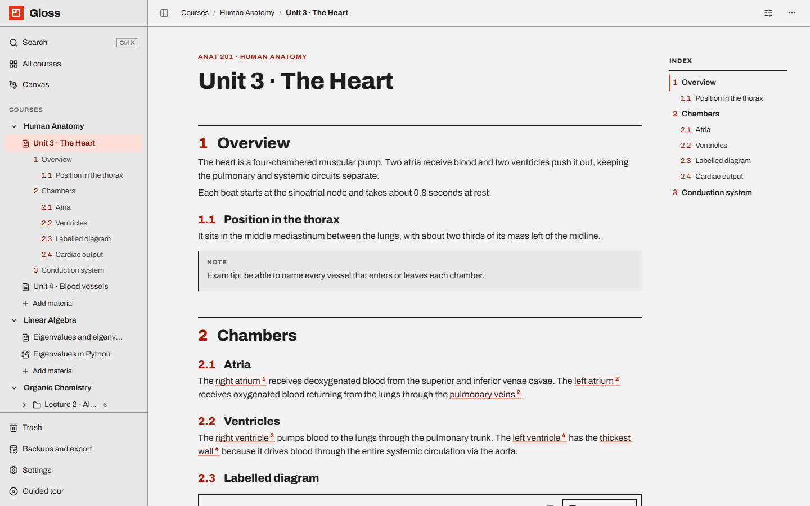
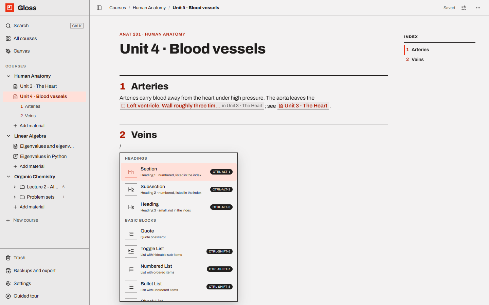
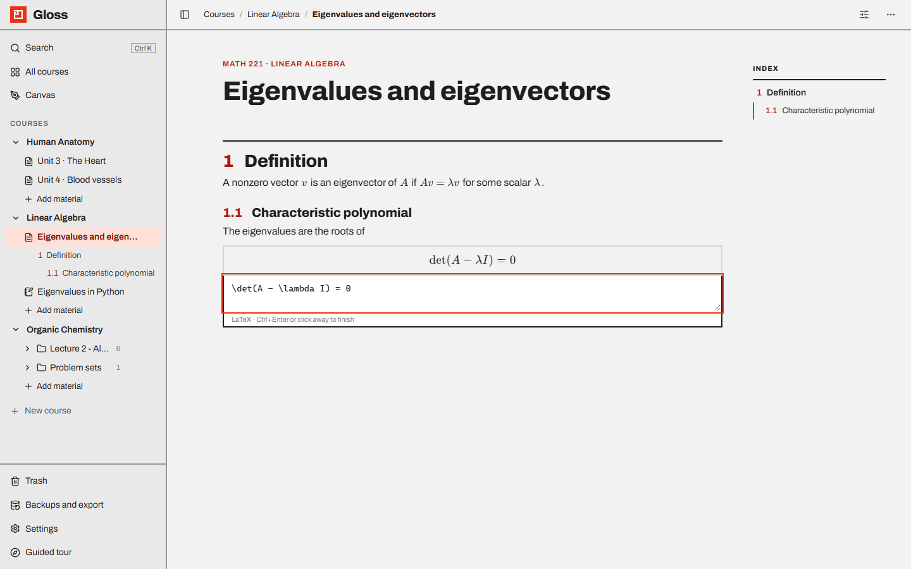
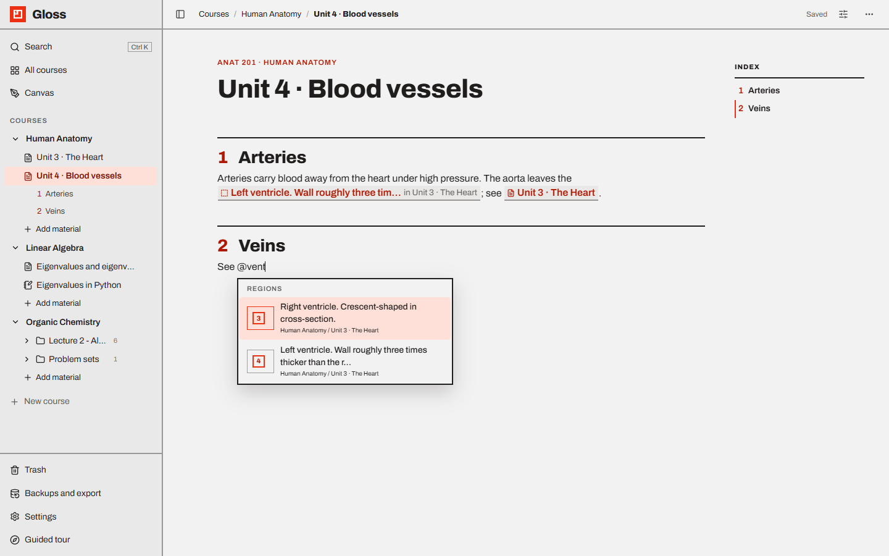
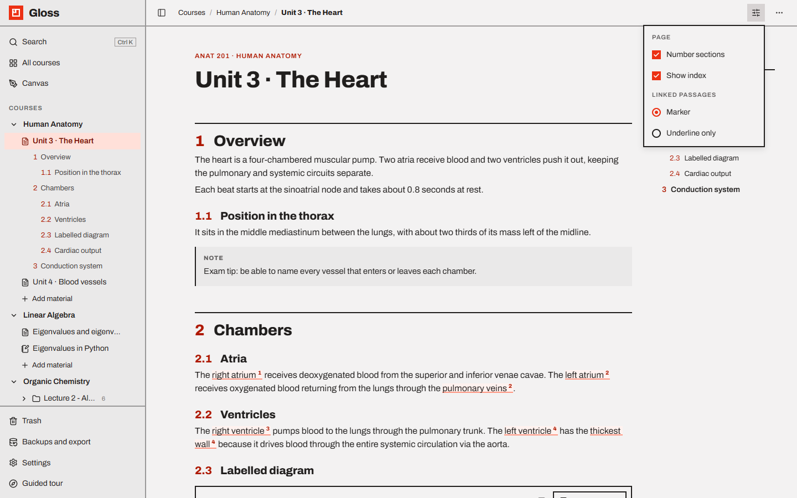
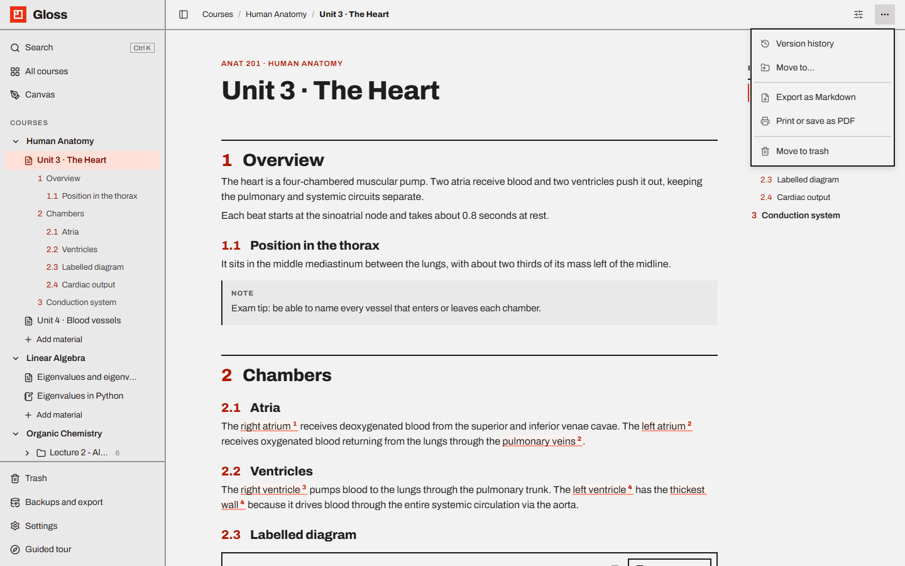

# Pages (the block editor)

A **Page** is a Notion-style document made of blocks. It is where you write notes with numbered sections, formulas,
annotated images, drawings and links to other materials.

- [Anatomy of a page](#anatomy-of-a-page)
- [Writing and saving](#writing-and-saving)
- [The / menu](#the--menu)
- [Markdown and keyboard shortcuts](#markdown-and-keyboard-shortcuts)
- [Formatting toolbar](#formatting-toolbar)
- [Moving, nesting and deleting blocks](#moving-nesting-and-deleting-blocks)
- [Sections, subsections and the index](#sections-subsections-and-the-index)
- [Callouts](#callouts)
- [Tables](#tables)
- [Formulas (LaTeX)](#formulas-latex)
- [Links to other materials (@)](#links-to-other-materials-)
- [Images, drawings and files](#images-drawings-and-files)
- [View options](#view-options)
- [The page menu (⋯)](#the-page-menu-)

---

## Anatomy of a page



- **Label** above the title: course code · course name.
- **Title** — click to rename. On a new page the title is selected so you can type over it. `Enter` or `↓` in the
  title jumps into the page.
- **The page** itself. A new page starts with a Section called *Introduction* and an empty line.
- **Index** on the right (see [below](#sections-subsections-and-the-index)).
- **Linked from** at the bottom: other pages that link here with `@`, with their course and how many links they
  contain.
- The top bar shows where you are (*Courses / Course / Folder / Page* — click any part) and the save status.

## Writing and saving

Click anywhere and type. Empty lines show *Type '/' for blocks*.

Pages **save automatically** 0.7 seconds after you stop typing. The top bar shows *Saving…* then *Saved*. If the server
can't be reached it shows *Not saved — retrying on next edit*: your text stays in the page and is sent again with your
next change. Leaving the page also sends anything pending, and closing the tab makes a last-moment save.

`Ctrl Z` / `Ctrl Y` (or `Ctrl Shift Z`) undo and redo everything on the page, including changes to regions and
comments on images.

## The / menu



Type `/` at the start of a line (or anywhere) to open the block menu, then type to filter it (e.g. `/tab`, `/form`).
Use `↑` `↓` and `Enter`, or click. On an empty line the block replaces the line; otherwise it is added below.

| Group | Blocks |
| --- | --- |
| **Headings** | **Section** (Heading 1, numbered, in the index) · **Subsection** (Heading 2, numbered, in the index) · **Heading** (Heading 3, small, not in the index) |
| **Basic blocks** | Quote · Toggle List · Numbered List · Bullet List · Check List · Paragraph · Code Block · Divider · **Callout** · **Formula** · **Inline formula** |
| **Advanced** | Table |
| **Media** | **Annotated image** · Video · Audio · File · **Drawing** |
| **Subheadings** | Toggle Heading 1 / 2 / 3 — collapsible headings (Toggle Heading 1 and 2 still count as Section and Subsection) |
| **Others** | Emoji |

Useful search words: `h1`/`section`/`#`, `h2`/`subsection`/`##`, `image`, `img`, `figure`, `region`, `draw`,
`sketch`, `whiteboard`, `note`, `tip`, `warning`, `exam`, `math`, `equation`, `latex`, `$$`.

## Markdown and keyboard shortcuts

Type these at the start of a line, followed by a space:

| Type | Get |
| --- | --- |
| `#` | Section |
| `##` | Subsection |
| `###` | Heading |
| `-` `+` or `*` | Bullet list |
| `1.` | Numbered list |
| `[]` / `[x]` | Check list item (unchecked / checked) |
| `>` | Quote |
| ```` ``` ```` | Code block (you can add a language: ```` ```python ````) |
| `---` | Divider |

Inline: `` `code` ``, `**bold**`, `*italic*`, `~~strike~~`, `$formula$` (see [Formulas](#formulas-latex)), `@` to
link (see [Links](#links-to-other-materials-)), `:` and two letters for an emoji.

| Keys | Action |
| --- | --- |
| `Ctrl B` / `Ctrl I` / `Ctrl U` | Bold / italic / underline |
| `Ctrl Shift S` | Strike-through |
| `Ctrl E` | Inline code |
| `Ctrl K` (with text selected) | Make a link |
| `Ctrl Alt 1` / `2` / `3` | Section / Subsection / Heading |
| `Ctrl Alt 0` | Paragraph |
| `Ctrl Shift 6` / `7` / `8` / `9` | Toggle list / numbered list / bullet list / check list |
| `Ctrl Alt Q` | Quote |
| `Tab` / `Shift Tab` | Nest / un-nest the block |
| `Ctrl Z` / `Ctrl Y` / `Ctrl Shift Z` | Undo / redo / redo |

In a code block, `Tab` indents, `Enter` adds a line, `Shift Enter` (or `Enter` after two empty lines) leaves the
block. On a Mac use `⌘` instead of `Ctrl`.

## Formatting toolbar

Select text to get the toolbar:

- **block type** (Paragraph, Heading 1–3, Toggle Heading 1–3, Quote, lists),
- **bold**, **italic**, **underline**, **strike**,
- **alignment** (left, centre, right),
- **colours** for text and background (gray, brown, red, orange, yellow, green, blue, purple, pink),
- **nest** / **un-nest**,
- **create link** — hover a link later to edit, open or remove it,
- **Σ Formula** — turns the selected text into an inline formula,
- **Link to region** (only on pages with annotated images) — links the selected passage to one of the page's image
  regions; see [Annotated images](annotated-images.md#linking-text-to-a-region).

## Moving, nesting and deleting blocks

Hover a block to see **+** (add a block below) and **⋮⋮** (drag handle). Drag the handle to move the block; click it
for the block menu: **Delete**, **Colors** (for text blocks) and, in tables, **Header row** / **Header column**.

## Sections, subsections and the index

The structure of a page comes from its headings:

- **Section** (Heading 1) is numbered **1, 2, 3…**
- **Subsection** (Heading 2) is numbered **1.1, 1.2…** and starts again in every Section (a Subsection before any
  Section is numbered 0.1).
- **Heading** (Heading 3) is a plain small heading: no number, not in the index.

The numbers are drawn by Gloss (you don't type them) and follow automatically when you move or add sections.

The **Index** on the right lists every Section and Subsection, live as you type:

- it highlights the section you are reading as you scroll,
- click an entry to scroll to it (it briefly flashes),
- an empty page shows *Add a Section or Subsection (type / in the page) and it appears here.*,
- it is hidden on windows narrower than about 1180 pixels.

The **sidebar** shows the same outline under the open page; click an entry to jump there.

## Callouts

`/callout` adds a boxed note. Click its small label to cycle the tone: **note → tip → warning → exam**. Warning and
exam boxes are tinted red; note and tip are neutral. Callouts hold formatted text, formulas and links.

## Tables

`/table` adds a table. Click inside to type; use the handles on rows and columns to add or delete rows and columns,
merge and split cells, and colour cells. **Header row** and **Header column** are in the block menu (⋮⋮).

## Formulas (LaTeX)



Formulas are written in LaTeX and drawn with [KaTeX](https://katex.org).

**A formula inside a line**

- Type `$` + LaTeX + `$` — for example `$\lambda$` or `$x^2 + y^2$`. When you type the closing `$`, the text turns
  into a formula. It does **not** happen when there is a space just inside a dollar (so *"$5 and $10"* stays text),
  when the first `$` is glued to a word or escaped (`\$`), or inside a code block.
- Or `/inline formula`, or select text and press **Σ** in the toolbar.
- **Click a formula** to edit it: a small box opens with the LaTeX and a live preview. `Enter` (or clicking away)
  keeps it; `Esc` cancels the change. Emptying it removes the formula.

**A formula on its own line**

- Type `$$` on an empty line, or `/formula`.
- The block opens for editing: type LaTeX in the box below; the preview above updates as you type.
- `Ctrl Enter`, `Esc` or clicking away finishes. Click the formula later to edit it again.

Mistakes in LaTeX are shown in red instead of breaking the page. Formulas are kept as `$…$` / `$$…$$` in
[Markdown exports](backups-and-export.md#markdown-export) and printed in PDFs.

## Links to other materials (@)



Type `@` to link another material:

- the menu lists **Pages** (any material: pages, images, notebooks, folders, slides) from every course, most recently
  edited first, with their *Course / Folder* path;
- type to search; matching **Regions** of images (found by their comment) are listed too;
- `↑` `↓` `Enter` or click to insert the link.

A link shows as a chip with the material's icon and its **current title** (renaming the target updates every link).
A region link shows its comment and *in Page title*.

- **Click** a link to open the material. A region link opens the page and lights up that region for a moment.
- `Ctrl`/`⌘`/`Shift`-click or middle-click opens it the browser's way (new tab or window).
- If the target was deleted, the link is struck through: *This material was deleted or moved to the trash.* Restore it
  from the Trash and the link works again.

Every material shows **Linked from** with the pages that link to it.

## Images, drawings and files

- **Images** — paste (`Ctrl V`) or drop an image anywhere in a page, or `/annotated image`. Every image is an
  annotated image you can mark up: see [Annotated images](annotated-images.md).
- **Drawings** — `/drawing` opens the canvas over the page; see [Canvas](canvas.md#drawing-from-inside-a-page).
- **Video, Audio, File** — from the / menu, or drop such a file into the page. Select the block for its toolbar:
  caption, replace, rename, download, delete, preview on/off.

## View options



The **sliders** icon in the top bar (*Page view options*):

| Option | Effect |
| --- | --- |
| **Number sections** | Show or hide section numbers in pages, the index and the sidebar. |
| **Show index** | Show or hide the index column. |
| **Linked passages: Marker** | Text linked to image regions is tinted and underlined. |
| **Linked passages: Underline only** | Linked text is only underlined until you hover it. |

These choices are remembered by your browser and apply to every page. To change the app's colours and fonts, see
[Themes](themes.md).

## The page menu (⋯)



The **⋯** icon in the top bar (*More actions*):

- **Version history** — earlier states of the page; preview and restore ([details](trash-and-history.md#version-history)).
- **Move to…** — another course or a folder ([details](workspace.md#moving-and-organising)).
- **Export as Markdown** — a zip with the page and its images ([details](backups-and-export.md#markdown-export)).
- **Print or save as PDF** — a printable view ([details](backups-and-export.md#print-and-pdf)).
- **Move to trash** — with Undo ([details](trash-and-history.md)).
