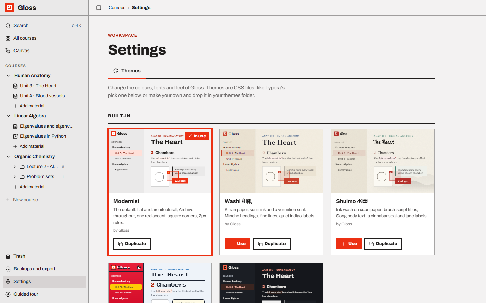
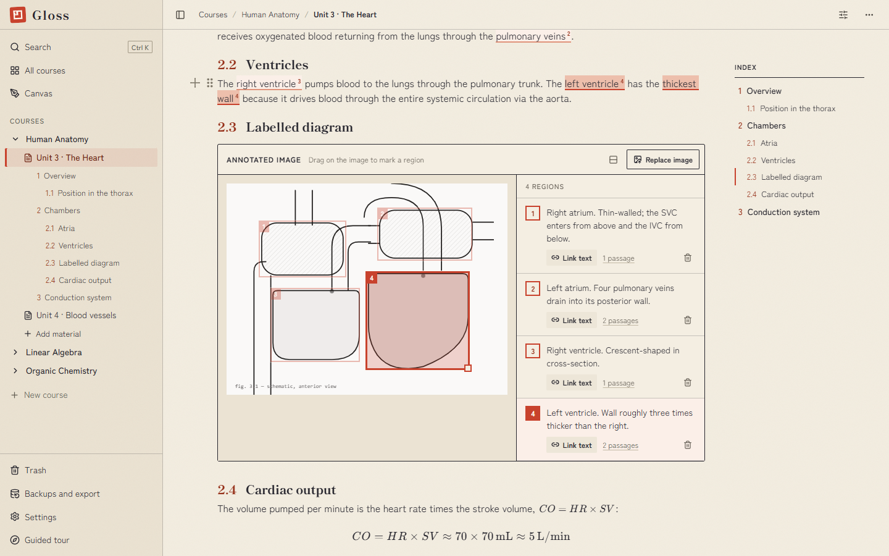
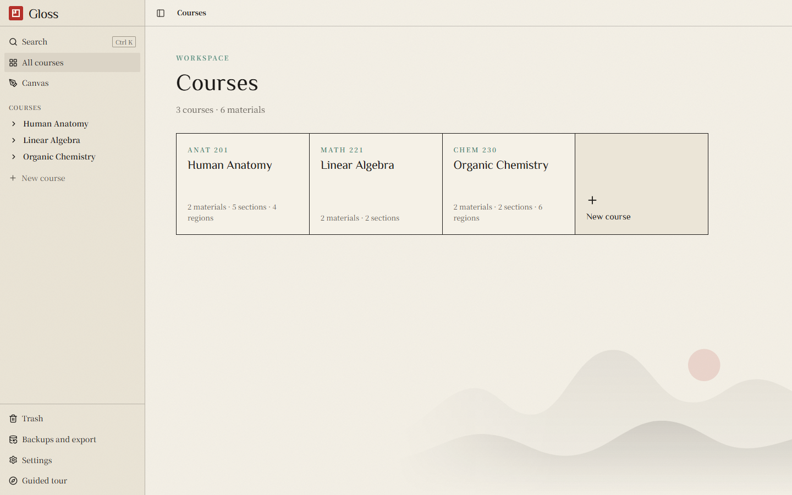
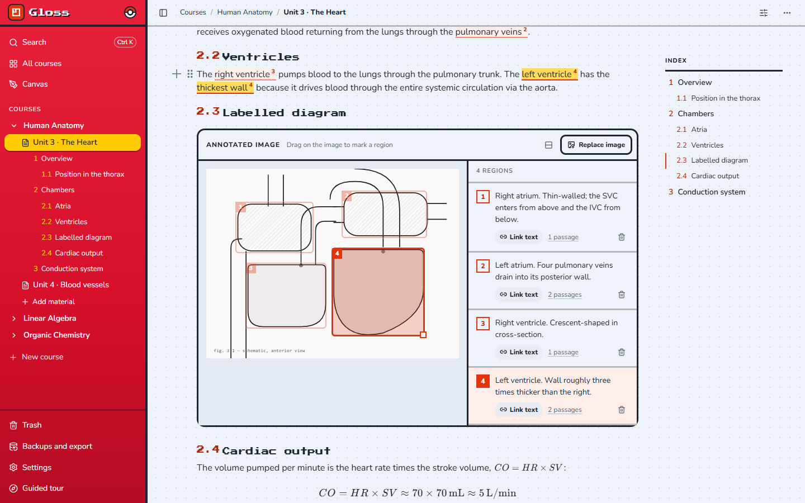
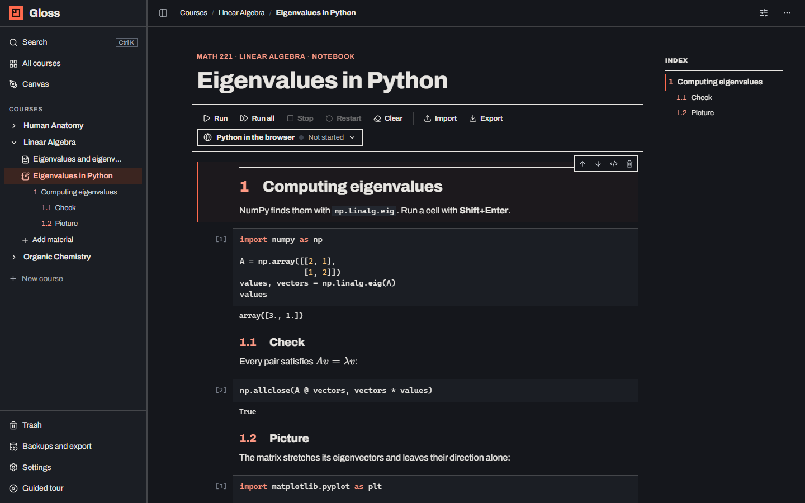

# Themes

Change the colours, fonts and feel of the whole app. Themes work like Typora's: each theme is a CSS file. Pick one in
**Settings → Themes**, or write your own in any text editor.



- [Choosing a theme](#choosing-a-theme)
- [The built-in themes](#the-built-in-themes)
- [Making your own theme](#making-your-own-theme)
- [The theme file](#the-theme-file)
- [Variables reference](#variables-reference)
- [Going further with CSS](#going-further-with-css)
- [Fonts and pictures](#fonts-and-pictures)
- [Sharing, removing and good to know](#sharing-removing-and-good-to-know)

---

## Choosing a theme

Open **Settings** at the bottom of the sidebar (or `/settings/themes`).

- Every theme has a **live preview**: a small copy of the app drawn with the theme itself, so you see its real colours,
  fonts and textures.
- Click a preview or **Use** to switch. The whole app changes at once; the current theme is marked **In use**.
- **Duplicate** copies any theme into your own themes so you can change it.

Your choice is saved with your notes (in the database), so it applies in every browser you open Gloss in. It also
loads before the page draws, so there is no flash of the default look.

## The built-in themes

| Theme | Feel |
| --- | --- |
| **Modernist** (default) | Flat and architectural: Archivo throughout, one red accent, square corners, 2px rules. |
| **Washi 和紙** | Kinari paper with a fibre texture, sumi ink, a vermilion seal for the logo, Shippori Mincho headings, Zen Kaku Gothic text, fine 1px lines and indigo labels. |
| **Shuimo 水墨** | Ink wash on xuan paper: brush-script titles (Ma Shan Zheng), Song-style text, faint ink mountains and a red sun in the corner, cinnabar accents and jade labels. |
| **Pokémon** | A Pokédex-red sidebar, a Poké Ball by the name, pixel headings (Press Start 2P), rounded chunky buttons with hard shadows, game-style text boxes and a dotted background. A fan theme inspired by the games. |
| **Midnight** | A dark theme: deep slate, warm off-white text and a coral accent. Images stay on a light plate so diagrams remain readable. |

| | |
| --- | --- |
|  |  |
|  |  |

The Japanese and Chinese themes ship the Latin letters of their fonts; Japanese and Chinese characters use the fonts
already on your computer (Yu Mincho, Hiragino, Songti, SimSun, Noto CJK…), so they work offline.

## Making your own theme

1. In **Settings → Themes**, click **New theme** (a fresh copy of the commented template), or **Duplicate** a theme you
   like. It appears under **Your themes** and is switched on.
2. Click **Open themes folder** and open the new `.css` file in any text editor (VS Code, Notepad, TextEdit…).
3. Change a value — say `--color-accent: #2a75bb;` — and save.
4. Switch back to Gloss: the change shows as soon as the window has focus. No restart, no reload.

Other ways in:

- **Add a theme file…** imports a `.css` file someone sent you.
- Or just put `.css` files in your themes folder yourself: `data/themes/` in the Gloss folder (the exact path is shown
  at the bottom of the Themes tab, with a copy button).

## The theme file

A theme starts with a comment that names it, followed by CSS:

```css
/*
 * @name        Ocean
 * @author      Sam
 * @description Deep blue and sand, with rounded corners.
 * @scheme      light
 */

:root {
  --color-bg: #f4f1ea;
  --color-surface: #e9e4d8;
  --color-accent: #1f6feb;
  --radius: 8px;
}
```

| Header | Meaning |
| --- | --- |
| `@name` | The name shown in Settings (otherwise the file name). |
| `@author` | Shown as "by …". |
| `@description` | One line under the name. |
| `@scheme` | `light` or `dark`. Dark also switches the drawing canvas to dark mode, and is skipped when printing. |
| `@order` | Optional number for sorting (used by the built-in themes). |

Everything you leave out keeps the default (Modernist) value, so a theme can be three lines long.

## Variables reference

The variables below are what the app is built from. The full list, with comments, is in the template:
[`themes/_template.css`](../themes/_template.css).

| Variable | Used for |
| --- | --- |
| `--color-bg` | Page background |
| `--color-surface` | Sidebar, panels, code blocks |
| `--color-paper` | Text fields, cards and pop-ups that sit on the page |
| `--color-text` | Text, and thin ink rules |
| `--color-accent` | The strong colour: buttons, section numbers, regions |
| `--color-on-accent` | Text and icons on the accent colour |
| `--color-success` | The "idle" dot of a notebook kernel |
| `--color-image-bg` | Behind images, slides and drawings |
| `--color-divider` | Light dividing lines (by default: text colour at 40%) |
| `--page-background` | The main area's background: any CSS background (colour, gradient, picture) |
| `--sidebar-background` | The sidebar's background |
| `--color-neutral-100` … `-900` | Greys from light to dark (in a dark theme: dark to light). 100–300 are hover and selected backgrounds, 500–700 quiet text |
| `--color-accent-100` … `-900` | Accent shades. 100–300 are tints (highlighted passages, hover); 600–900 deeper shades for text and links |
| `--font-body` | Body text |
| `--font-heading` | Titles and headings |
| `--font-heading-weight` | Weight of titles and headings |
| `--font-mono` | Code |
| `--radius-sm`, `--radius`, `--radius-lg` | Corner rounding: buttons and rows; menus, callouts and cards; dialogs |
| `--rule-width` | Thickness of lines and borders |
| `--shadow-sm`, `--shadow-md`, `--shadow-lg` | Shadows |
| `--code-keyword`, `--code-string`, `--code-comment`, `--code-number`, `--code-name`, `--code-muted` | Code colours in notebooks |
| `--ansi-red` … `--ansi-white` | Coloured terminal output in notebooks |

For a **dark theme**, also set `color-scheme: dark;` inside `:root` and `@scheme dark` in the header, and flip the
neutral scale (100 = darkest).

## Going further with CSS

Below the variables, write any CSS you like. Some useful selectors:

| Selector | What it is |
| --- | --- |
| `.sidebar`, `.sidebar-brand`, `.brand-name` | The left column, the logo row, the name "Gloss" |
| `.topbar`, `.crumbs` | The bar at the top, the breadcrumbs |
| `.page-title`, `.input-title` | Big titles (fixed and editable) |
| `.kicker` | Small capitals labels above titles |
| `.btn-primary`, `.btn-secondary` | Buttons |
| `.material-doc` | A page (the block editor) |
| `.material-doc [data-content-type="heading"]` | Section headings (`[data-level="2"]` for subsections) |
| `.index-panel` | The index on the right |
| `.ann-box`, `.ann-link` | A region on an image, a passage linked to it |
| `.callout` | Callout boxes |
| `.nb-cell` | A notebook cell |
| `.course-card`, `.material-row.is-active` | A course on the home page, the open material in the sidebar |

Variables can be changed **for one area only**. The Pokémon theme's red sidebar is just:

```css
.sidebar {
  --color-text: #ffffff; /* everything in the sidebar that uses the text colour turns white */
  --color-neutral-300: rgba(255, 255, 255, 0.2); /* hover background */
  --color-neutral-700: rgba(255, 255, 255, 0.82); /* quiet labels */
  color: #ffffff;
}
```

Headings in the page editor are sized with `--level` (Sections 28px, Subsections 20px by default):

```css
.material-doc [data-content-type="heading"] { --level: 24px; }
```

The built-in themes in [`themes/`](../themes/) are good examples to read.

## Fonts and pictures

Put files in a folder named like the theme, next to it, and link them relatively:

```
data/themes/
  ocean.css
  ocean/
    fonts/Lora-Regular.woff2
    waves.png
```

```css
@font-face {
  font-family: "Lora";
  src: url("ocean/fonts/Lora-Regular.woff2") format("woff2");
  font-weight: 400;
}

:root {
  --font-body: "Lora", Georgia, serif;
  --page-background: url("ocean/waves.png") bottom right / 400px no-repeat, var(--color-bg);
}
```

**Duplicate** copies a theme's folder too and fixes its links. You can also embed small pictures directly as
`url("data:image/svg+xml;utf8,…")` — Washi's paper texture and Shuimo's mountains are made that way.

Web fonts (`@import url("https://fonts.googleapis.com/…")`) work too, but need internet; local font files keep the
theme working offline.

## Sharing, removing and good to know

- **Share** a theme by sending its `.css` file (and its folder, if it has one). The receiver uses **Add a theme
  file…**, or copies them into their themes folder.
- **Remove** (trash icon on your own themes) moves the file to `data/themes/.removed/` rather than deleting it.
  Built-in themes can't be removed; if you remove the theme in use, Gloss returns to Modernist.
- Your themes live in `data/themes/`, so they are included in **Export everything** and survive updates. Built-in
  themes are in the app's `themes/` folder and come with updates.
- **Printing** (Save as PDF) uses the current theme, except dark ones: prints stay light.
- A theme can only change how things look. It can load fonts and pictures from the internet, so only add themes from
  people you trust.
