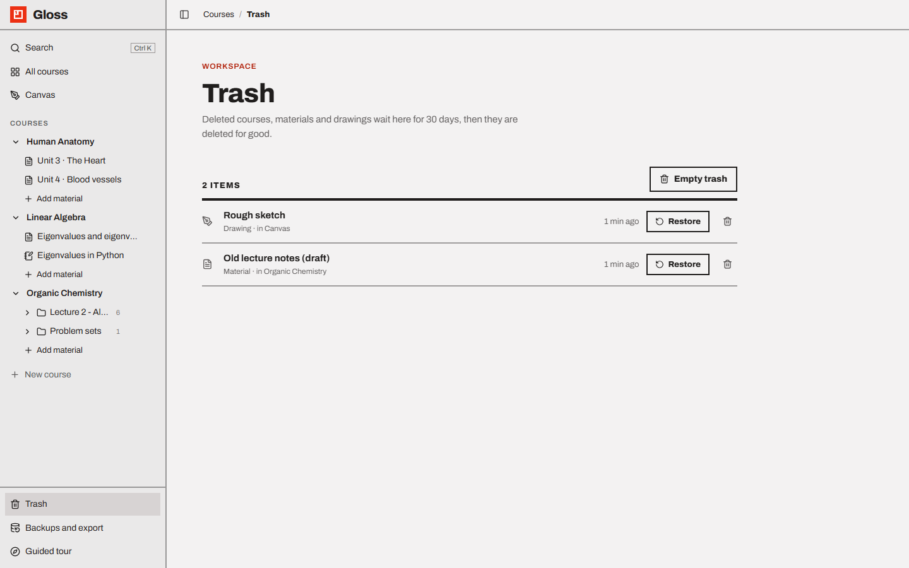
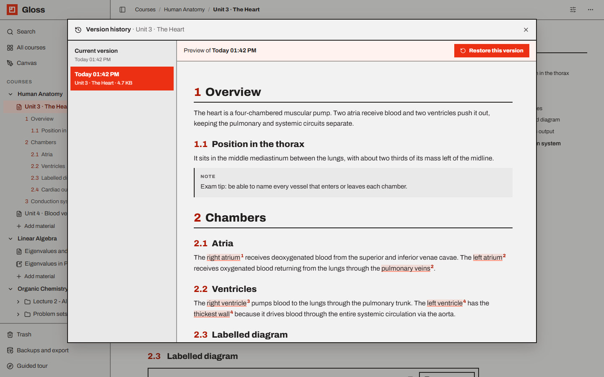

# Trash and version history

Nothing in Gloss disappears at the first click. Deleted things go to the **Trash** for 30 days, and every material
keeps **earlier versions** of its content while you edit.

- [The Trash](#the-trash)
- [Undo right after deleting](#undo-right-after-deleting)
- [Restoring](#restoring)
- [Deleting for good](#deleting-for-good)
- [Version history](#version-history)

---

## The Trash

Open **Trash** at the bottom of the sidebar (`/trash`). It lists everything deleted in the last 30 days, newest first.
Each row shows:

- an icon for what it is (course, drawing, folder, page, image, notebook),
- its **title**,
- what it was and where: *Material · in Human Anatomy / Week 3*, *Course · 4 materials*, *Folder · in Biology ·
  32 pages*, *Drawing · in Canvas*,
- when it was deleted (*just now*, *5 min ago*, *3 h ago*, *yesterday*, *6 days ago*); hover it to see how many days
  are left before it is deleted for good,
- **Restore** and a trash icon (**Delete for good**).

What goes to the trash, and what goes with it:

| You delete | From | Also goes to the trash |
| --- | --- | --- |
| A course | the course page (**Move course to trash**) | all its materials and folders |
| A folder | the sidebar, course page or the folder's **⋯** menu | everything inside it |
| A page, image or notebook | the sidebar, course page or the page's **⋯** menu | — |
| A drawing | the drawing's toolbar in the Canvas | — (pages that show it display a placeholder) |

Removing a drawing *block* from a page does not delete the drawing; it stays in the Canvas.

## Undo right after deleting

Every delete shows a message at the bottom of the screen — *Moved "Unit 3 · The Heart" to the trash* — with
**Undo** for about 8 seconds. Undo restores it straight away.

## Restoring

Click **Restore** in the Trash. A message confirms *Restored "…"*. The item comes back where it was, with everything
that was deleted together with it (a course with its materials, a folder with its pages). Links to it (`@` links and
drawing blocks on pages) work again.

Special cases:

- **A page whose folder is still in the trash** comes back at the top level of its course.
- **A material whose course is in the trash** can't come back on its own: *This was in "Human Anatomy", which is in
  the trash too. Restore the course first.* Restore the course; materials that were deleted separately before the
  course stay in the Trash for you to restore one by one.

## Deleting for good

- **Delete for good** (trash icon on a row) asks *Delete "…" for good? This cannot be undone.*
- **Empty trash** (top of the list) asks *Delete all N items in the trash for good?* and confirms *Trash emptied*.
- Anything older than **30 days** is deleted automatically. Gloss checks when it starts and every 6 hours while it
  runs.

Deleting for good removes the database rows, including the material's version history. Uploaded image and PDF files
stay in `data/uploads/` (see [Known limits](troubleshooting.md#known-limits)).

## Version history

Open a page, image page or notebook and choose **⋯ → Version history** in the top bar (folders have no content of
their own, so they don't have it).

How versions are made:

- While you edit, Gloss keeps the **previous state** at most once every **10 minutes**. The first edit after opening
  an old page always keeps the state before it.
- Up to **100 versions** are kept per material; older ones are dropped.
- Versions cover the content (text, blocks, regions and comments, notebook cells and outputs). Renaming alone does not
  make a version.

The dialog:

- Pending edits are saved first, so **Current version** really is current.
- The left column lists **Current version** and every earlier version with its time (*Today 14:05*, *Yesterday
  09:12*, *Mon 3 Oct 14:05*), title and size.
- Click a version to **preview** it on the right: pages are shown as formatted text with numbered sections, images
  with their regions and comments, notebooks with their cells and outputs.
- **Restore this version** replaces the content. The state you replace is kept as a version too, so restoring can
  always be undone by restoring again. A message confirms *Restored the version from …*.
- `Esc` or a click outside closes the dialog.
